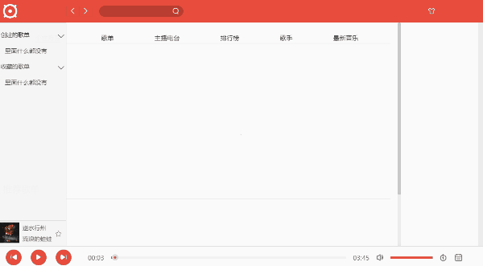

## 网易云音乐pc端

---

### 功能特性

1. 登录(目前只能邮箱登录)，拥有签到
2. 首页(推荐)
3. 搜索(歌曲，用户，视频，其它待完善)
4. 音乐播放器
5. 视频播放器(评论以评论的方式和弹幕形式触发)
6. 歌单列表
7. 用户界面(关注，取消关注)
8. 评论单曲(视频待后续改进)
9. 用户提示(toast、loading)

### 数据请求
src/http/config   baseURL如(http://localhost:7890)


---



---


---


---

### 环境要求

> node >= 12+环境

---

### 安装

``` 
git clone https://github.com/hilxx/colude-music-desk.git
yarn install
```

### 运行

``` 
打包 yarn build(生产环境)    yarn dev-build(开发环境)
devServer yarn dev
```

1. 服务器默认端口1234，修改在src/build/webpack.server.js
2. 请求服务器 https://github.com/hilxx/NeteaseCloudMusicApi
3. 请求服务器的端口号(默认7890)，修改在src/build/webpack.server.js
4. 打包文件在dist目录

---

### 文件说明

1. 采用-连接文件名, 比如song-menu
2. 不同目录下的文件夹可能拥有有相同的名字, 这情况不会出现的公共组件。
3. 入口文件请找到src/home, 路由采用采用脱离文档流方式覆盖页面。
4. store请查看src/store, 全部store集中在该文件。
5. 全局的一些配置(路径、图标等)请在src/config查看
6. src文件夹下的.css不开启cssModules, .less文件开启cssModules

---

### 编码习惯

1. 后续添加自定义外部变量采用_开头, 自定义外部函数采用_结尾, 部分除外(React、actionsCreator...)。
2. 连接connect的container组件, 忽略eslint的propsType警告
